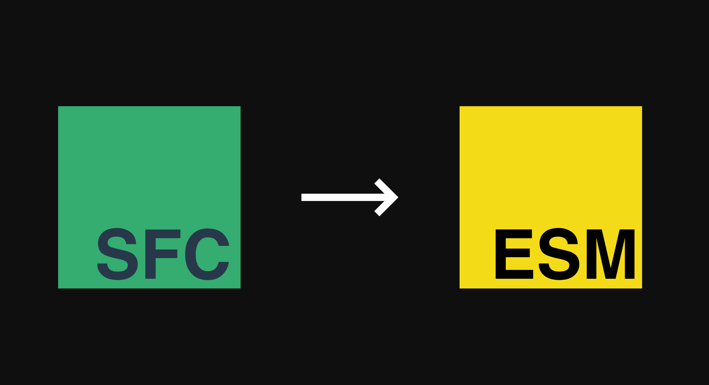

<h1 align='center'>
  sfc2esm
</h1>



<br>

<p align='center'>
  <b>English</b> | <a href="./README.zh-CN.md">简体中文</a>
</p>

<br>

Convert the Vue SFC source code to the code in browser esm format

## API

```ts
export declare function sfc2esm(sfcSource: string, { id, appName, mount }: Options): {
  esmCode: string
  cssCode: string
}
export interface Options {
  id?: string
  appName?: string
  mount?: string
}
```

## Who is using this?

<a href="../../../setupin">
  
</a>

 [setupin](../../../setupin)

<br>

<p align='right'>
  logo by:
  <a href="https://github.com/xiaoluoboding/vue-sfc2esm">
    vue-sfc2esm
  </a>
</p>
<p align='right'>
  dependencies:
  <a href="https://github.com/vuejs/core/tree/main/packages/compiler-sfc#readme">
    @vue/compiler-sfc
  </a>
</p>
