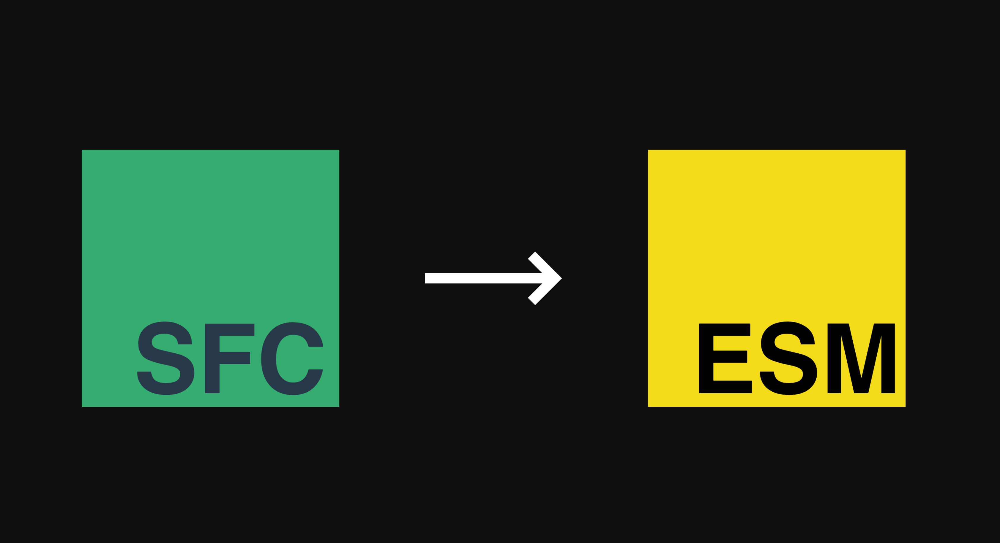

<h1 align='center'>
  sfc2esm
</h1>



<br>

<p align='center'>
  <a href="./README.md">English</a> | <b>简体中文</b>
</p>

<br>

关于各种Vue SFC源码转换的方法

## API

```ts
export interface Options {
  id?: string
  appName?: string
}
export declare function useXxx2x({ id, appName }?: Options): {
  scr2app: (scriptSource: string, setup?: boolean) => string
  tem2render: (templateSource: string) => string
  sty2css: (styleSource: string, scoped?: boolean) => string
  sfc2x: (sfcSource: string, mount?: string) => {
    esm: string
    app: string
    render: string
    css: string
  }
}
```

## 谁在用这个？

<a href="../../../setupin">
  
</a>

 [setupin](../../../setupin)

<br>

<p align='right'>
  logo by:
  <a href="https://github.com/xiaoluoboding/vue-sfc2esm">
    vue-sfc2esm
  </a>
</p>
<p align='right'>
  dependencies:
  <a href="https://github.com/vuejs/core/tree/main/packages/compiler-sfc#readme">
    @vue/compiler-sfc
  </a>
</p>
